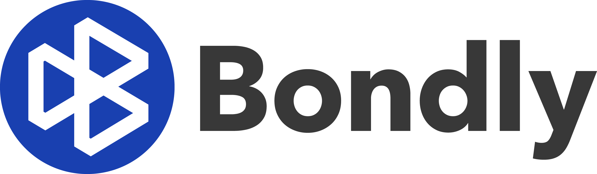

  

<h3 align="center">
  Trusted, transparent and portable swap transactions between parties in any marketplace
</h3>

  Bondly is an open source peer-to-peer cryptocurrency exchange tool that focuses
  on portability, ease of use, and economic efficiency.

  
  
  

- **Versatile.** Share escrow-based transactions through any medium.

- **Interoperable.** Bondly enables transactions across many chains.

- **Innovative.** Connect Bondly to your marketplace and create trusted transactions between vendors and customers.

  <a href="https://bondly.finance">
    <b>Learn more about Bondly here.</b>
  </a>

## What’s In This Document

- [Code of Conduct](#code-of-conduct)
- [How to Contribute](#how-to-contribute)
- [License](#license)
- [Thanks](#thanks)

## Code of Conduct

We strive to create a healthy, inclusive, and safe environment for all people
and follow the [Contributor Covenant](https://contributor-covenant.org). Please
take a look at our [Code of Conduct](./CODE_OF_CONDUCT.md) for more
information.

## How to Contribute

Regardless of how you seek to contribute, we'd love to have you as part of the
Bondly developer community!

Check out our [Developer Community Discord](https://discord.com/invite/94BCJg)
for more information about contributing to Bondly.

## License

Licensed under the [MIT License](./LICENSE).

## Thanks

Thanks to everyone who has made a contribution, no matter how big or small!
:heart:
